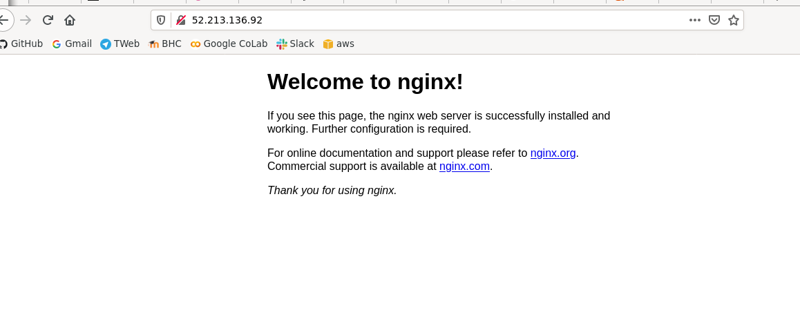

# Prerequirement:
You need ssh key pair, AWS CLI, terraform, /bin/bash
#
#Instalation:
```
git clone https://github.com/su115/ansible-terraform.git
terraform init
terraform apply
./init.sh
```
Thats all:)


